Medical data from volunteers used in the examples was anonimized.

# 2D Image Registration
## Breathing Motion

### Perfusion
`examples_ptv/perf.m`

Groupwise 2D registration with nuclear metric. 
Extreme breathing motion.

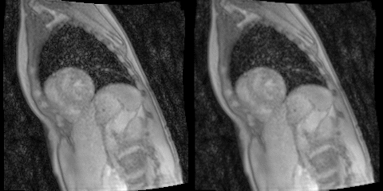

*Figure: input images; registered images; tracking animation;*

### MOLLI
`examples_ptv/molli.m`

Groupwise 2D registration with nuclear metric. 
Breathing motion.
Notice contrast inversion.

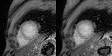
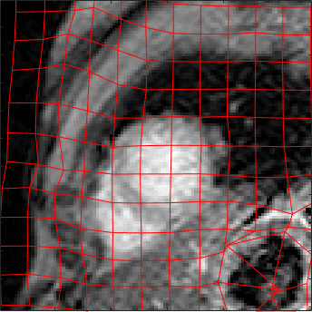

*Figure: input images; registered images; tracking animation;*

### Cardiac Diffusion Weighted MRI
`examples_ptv/dti.m`

Groupwise 2D registration with nuclear metric. 
Breathing motion.
Notice low SNR.

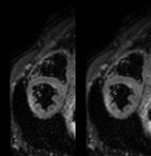

*Figure: input images; registered images;*

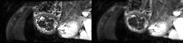

*Figure: input images; registered images;*

## Cardiac Motion

### Short Axis Cardiac MRI 
`examples_ptv/heart_SA.m`

Groupwise 2D registration with nuclear metric. 
Cardiac motion.

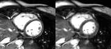
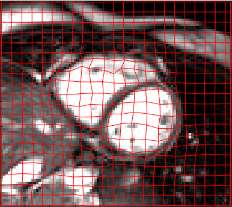

*Figure: input images; registered images; tracking animation;*

## Natural Images 
The method is not limited to medical images and can be applied to natural images without any modifications.

### Rolling Shutter
`examples_ptv/rolling_shutter2.m`

Groupwise and pairwise (with SSD metric) 2D registration routines both work well.
Multichannel (RGB) images.

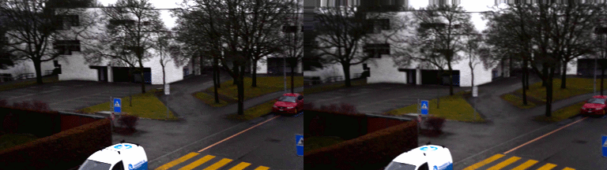

*Figure: input images; registered images;*

Now we can fit rigid or affine motion to estimated displacements and use them to stabilize images. 
We can observe "jelly" effect due to sequential CMOS sensor readout (rolling shutter) that can not be compensated for with linear motion models.

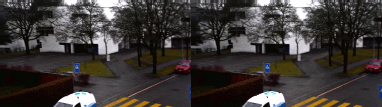

*Figure: rigid motion; affine motion*

### Faces
`examples_ptv/faces.m`

Groupwise 2D multichannel (RGB) registration of 550 facelapse images. 
Note that pairwise registration fails here (and about 10 times slower than groupwise).
Images extracted from [Noah Kalinas Youtube Video](https://www.youtube.com/watch?v=iPPzXlMdi7o)

*Figure: input images; registered images; tracking animation;*

To suppress nonrigid registration artefacts, fitting rigid+scale or affine model can help:

*Figure: rigid+scale motion; affine motion*

# 3D Image Registration
## Breathing Motion
### 3D+Time Lung CT. DIR Dataset
`examples_ptv/DIR_test_all.m`

Pairwise 3D registration using LCC metric. 

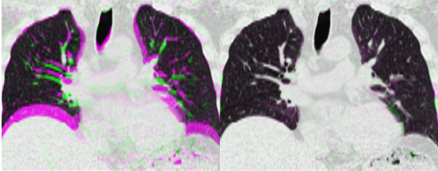

*Figure: overlayed initial images; overlayed registered images*

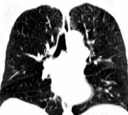
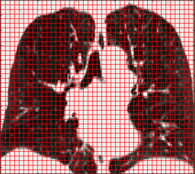

*Figure: registered images; tracking animation;*

Performance of pTV on [DIR challenge](https://www.dir-lab.com/ReferenceData.html).

| Method config        | 4DCT 1  | 4DCT 2  | 4DCT 3  | 4DCT 4  | 4DCT 5  | 4DCT 6  | 4DCT 7  | 4DCT 8  | 4DCT 9  | 4DCT 10  |**Mean TRE**|Mean Time (sec.)|
|----------------------|---------|---------|---------|---------|---------|---------|---------|---------|---------|---------|----------|---------|
|`cp_refinements = 0` `loc_cc_approximate = false` Original resolution |0.82|0.83|0.98|1.28|1.13|0.88|0.83|1.05|0.95|0.87|**0.96**|72|
|`cp_refinements = 0` `loc_cc_approximate = true` Original resolution |0.78|0.79|0.96|1.27|1.09|0.89|0.86|1.07|0.94|0.93|**0.96**|57|
|`cp_refinements = 0` `loc_cc_approximate = true` Resampled to 1x1x1 mm^3 |0.77|0.75|0.93|1.26|1.07|0.83|0.80|1.01|0.91|0.84|**0.92**|130|
|`cp_refinements = 0` `loc_cc_approximate = false` Resampled to 1x1x1 mm^3 |0.80|0.77|0.92|1.28|1.11|0.81|0.80|1.12|0.90|0.79|**0.93**|188|
|`cp_refinements = 1` `loc_cc_approximate = true` Resampled to 1x1x1 mm^3 |0.78|0.74|0.92|1.27|1.09|0.84|0.81|0.99|0.92|0.85|**0.92**|178|
|`cp_refinements = 1` `loc_cc_approximate = false` Resampled to 1x1x1 mm^3 |0.80|0.77|0.92|1.30|1.13|0.78|0.79|1.00|0.91|0.82|**0.92**|300|

*Table: TRE is computed in the snap-to-pixel fashion and given in millimeters.*

Note that according to the [leaderboard](https://www.dir-lab.com/Results.html), 
our method achieves the best registration result in terms of TRE (0.92 mm), and is one of the few methods that does not use lung masks.

### 3D+Time Lung CT. DIR Dataset. Groupwise
See `examples_ptv/DIR_groupwise.m`

Pairwise 3D registration using nuclear metric. This is just an example of 3D groupwise registration.
TRE between inhale and exhale states did not improve.

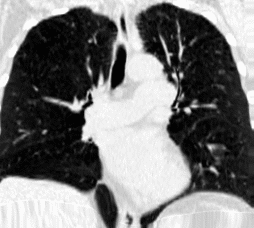
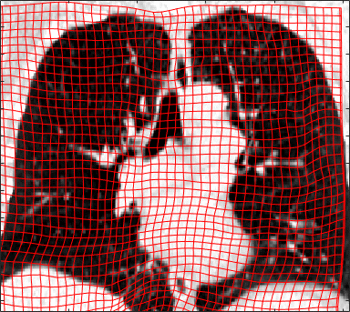

*Figure: registered images; tracking animation;*

### 3D Breathhold Lung CT. COPDgene Dataset
`examples_ptv/COPD_final.m` and `examples/COPD_finetue.m`

Pairwise 3D registration using LCC metric with displacement grid refinement.

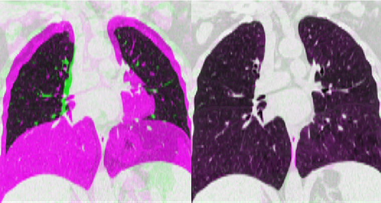

*Figure: overlayed initial images; overlayed registered images*

Performance of pTV on [COPDgene challenge](https://www.dir-lab.com/ReferenceData.html).

| Method config        | COPD 1  | COPD 2  | COPD 3  | COPD 4  | COPD 5  | COPD 6  | COPD 7  | COPD 8  | COPD 9  | COPD 10  |**Mean TRE**|Mean Time (sec.)|
|----------------------|---------|---------|---------|---------|---------|---------|---------|---------|---------|---------|----------|---------|
|`cp_refinements = 0` `loc_cc_approximate = false`  Linear interpolation |0.78|3.38|0.79|0.72|0.77|1.00|0.81|1.19|0.67|0.86|**1.09**|224|
|`cp_refinements = 0` `loc_cc_approximate = true`  Linear interpolation |0.79|3.81|0.83|0.78|0.98|0.90|0.82|1.02|0.72|1.07|**1.17**|186|
|`cp_refinements = 1` `loc_cc_approximate = false`  Linear interpolation |0.72|2.22|0.79|0.68|0.81|0.70|0.81|0.83|0.64|0.86|**0.91**|359|
|`cp_refinements = 1` `loc_cc_approximate = true`  Linear interpolation |0.74|3.22|0.79|0.74|0.80|1.13|0.81|0.85|0.66|0.92|**1.07**|275|
|`cp_refinements = 1` `loc_cc_approximate = false`  Cubic interpolation *Fine-tune* |0.71|1.91|0.77|0.67|0.71|0.66|0.75|0.78|0.64|0.85|**0.8461**|442|

*Table: TRE is computed in the snap-to-pixel fashion and given in millimeters.*

Note that according to the [leaderboard](https://www.dir-lab.com/Results.html), 
our method achieves the second best registration result in terms of TRE (0.85 mm), and is the best among methods that do not use lung masks.

### 3D MRI Liver
`examples_ptv/LIVER.m`

Pairwise 3D registration using LCC metric. 
Note that this dataset contains landmarks both inside and outside the liver.
Thus we can evaluate registration accuracy on the both sides of the sliding interface.

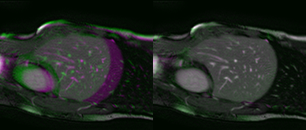

*Figure: overlayed initial images; overlayed registered images*

|Method config | Inside | Outside | Overall | Mean Time (sec.) |
|--------------|--------|---------|---------|------------------|
|`loc_cc_approximate = false` `cp_prefinements = 0` Original resolution| 1.88 | 1.72 | 1.80 | 22 |

*Table: TRE in millimeters.*

## Interpatient Registration
### 3D Aorta Segmentation
`examples/aorta_segmentation.m`

Pairwise 3D registration using SAD metric.
Here fixed image is accompanied with the segmentation of aorta. 
The aim is to acquire segmentation of the moving image.
We simultaneously (1) register both images and (2) align fixed segmentation with the moving image, using Gaussian intensity models of foreground and background pixels.

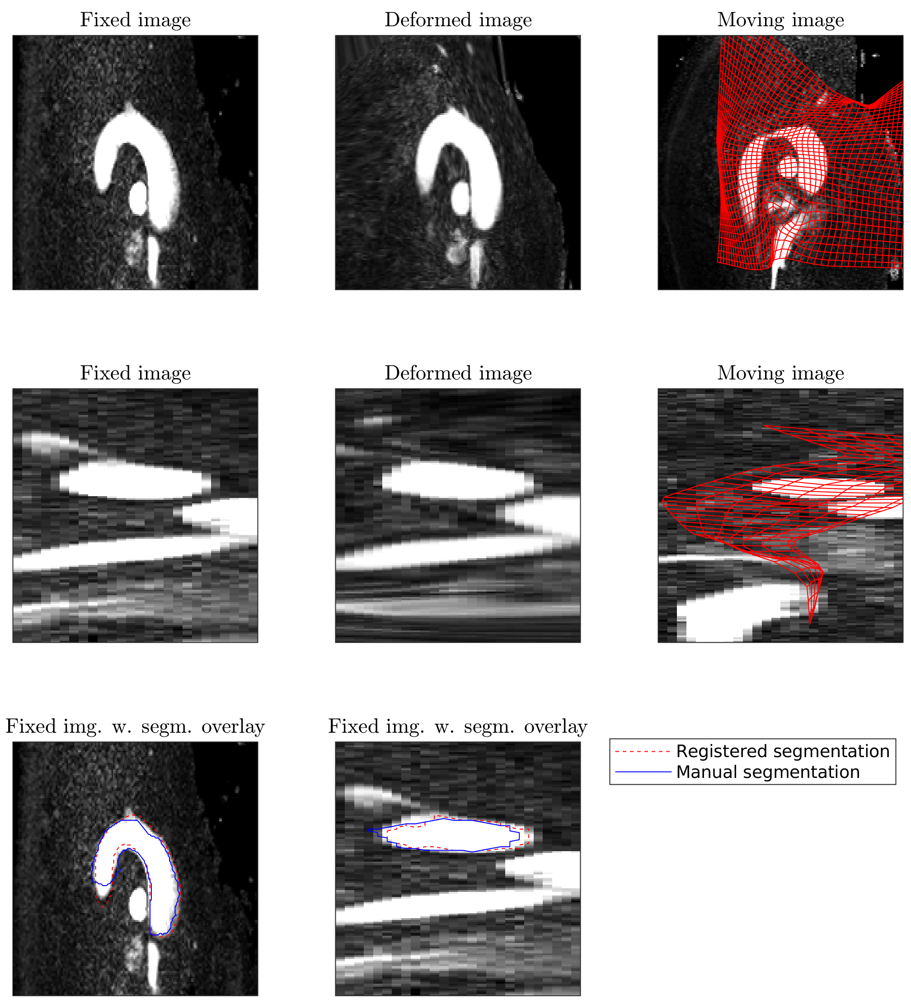

*Figure: fixed, moving and registered images with overlayed propagated and manual segmentations of aorta.*

